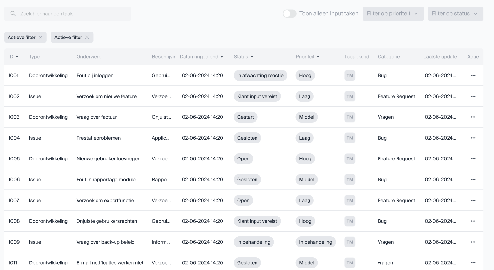

# Scherm ontwerpen

Naar vraag van Roel Dekkers, de inhouse UX designer zijn de bovengenoemde functionaliteiten ingedeeld ingedeeld per omgeving. Om groeperingen van de functionaliteiten binnen het programma en de interacties tussen de verschillende omgevingen zijn ze per 'pagina' gegroepeerd. Dit hoeven geen pagina's te zijn in de uiteindelijk te bouwen applicatie maar dienen als ondersteuning bij het UX ontwerp.

Naar vraag van Roel Dekkers, de inhouse UX designer zijn de functionaliteiten ingedeeld in verschillende omgevingen gebaseerd op de verschillende actors binnen dit project. Hierdoor zijn de volgende drie omgevingen uitgewerkt:

Algemeen: De omgeving waar een gebruiker zich in bevindt als hij/zij niet is aangemeld.

| Pagina  | Doel  | Oorsprong  |
|---|---|---|
| Registreren  | Het registreren van een nieuwe gebruiker in het PMP.  | [NFR4](./FunctioneelOntwerp.md#nonfunctional-requirements)  |
| Aanmelden  | Het aanmelden van een bestaande gebruiker in het PMP  | [NFR4](./FunctioneelOntwerp.md#nonfunctional-requirements)  |
| Wachtwoord vergeten  | Het resetten van een wachtwoord van een bestaande gebruiker in het PMP  | [NFR4](./FunctioneelOntwerp.md#nonfunctional-requirements)  |
| Over ons  | Een pagina met een korte omschrijving van Bluenotion en wat we doen  |   |
| Contact  | Contact informatie hoe mensen ons naast het PMP kunnen bereiken  |   |

Klant: De omgeving waar de gebruiker zich in bevindt als hij/zij is aangemeld als een admin van een project.

| Pagina  | Doel(en)  |
|---|---|
| [Mijn projecten pagina](#view2-mijn-projecten) | - Een globaal overzicht geven van de voor de klant beschikbare projecten. [FR1.1](./Requirements/FR1_Inzien_project_plannings_informatie.md#fr11-inzien-projecten)  - Om het extra duidelijk te maken voor de klant wanneer er iets van de klant wordt verwacht hier ook het lijstje met de "waiting for customer" lijst? [FR2.2](./Requirements/FR2_Inzien_taken.md#fr22-filteren-taken-op-waiting-for-feedback-internextern-open-stagingtesting-closed) |
| Project detail pagina  | - Een globaal overzicht geven van het door de klant geselecteerde project met snelle overzichten van de filters/lijstjes als beschreven in [FR2.2](./Requirements/FR2_Inzien_taken.md#fr22-filteren-taken-op-waiting-for-feedback-internextern-open-stagingtesting-closed)  -Overzicht van de voor het project relevante dependencies en services zoals beschreven in [FR6.1](./Requirements/FR6_Inzien_project_service_statuses.md#fr61-inzien-lijst-van-project-dependencies) en [FR6.2](./Requirements/FR6_Inzien_project_service_statuses.md#fr62-inzien-huidige-status-onlineoffline-project-dependencies).  - Optie voor een timeline of Gantt chart view? [FR2.4](./Requirements/FR2_Inzien_taken.md#fr24-tonen-taken-in-gantt-chart) |
| [Taken lijst pagina](#view6-takenoverview)  | - De taken lijstjes van de project detail pagina met extra informatie als wanneer er voor het laatst aan de taak is gewerkt, de datum waarop verwacht wordt dat de taak klaar is. [FR2.1](./Requirements/FR2_Inzien_taken.md#fr21-inzien-taken-van-project) & [FR2.2](./Requirements/FR2_Inzien_taken.md#fr22-filteren-taken-op-waiting-for-feedback-internextern-open-stagingtesting-closed) |
| [Taak detail pagina](#view3-taak-detail-view)  | - De pagina waar alle beschikbare informatie voor een taak te vinden is inclusief de aan de taak gekoppelde bijlages en comments. [FR2.3](./Requirements/FR2_Inzien_taken.md#fr23-inzien-taak-details)  - De gebruiker dient ook comments toe te kunnen voegen [FR3.2](./Requirements/FR3_Toevoegen_aanvraag.md#fr32-toelichting-geven-op-aanvraag) |
| [Toevoegen aanvraag pop-up/pagina/stappen&vragen](#view3-taak-detail-view)  | - Invoervelden waar de gebruiker een aanvraag kan doen. Invoer bestaat uit: naam, omschrijving, screenshot/bijlages, type (doorontwikkeling of issue), urgentie en impact (in geval van issue) [FR3.1](./Requirements/FR3_Toevoegen_aanvraag.md#fr31-toevoegen-nieuwe-aanvraag-in-een-project), [FR3.3](./Requirements/FR3_Toevoegen_aanvraag.md#fr33-toevoegen-taken-past-zich-aan-aan-de-klant-zijn-sla), [FR3.4](./Requirements/FR3_Toevoegen_aanvraag.md#fr34-toevoegen-bijlagen-bij-taak) |
| Aanpassen taak/aanvraag  | - Het aanpassen van een al toegevoegde taak of aanvraag. Zelfde invoer velden als Toevoegen aanvraag maar met ingevulde gegevens en de comments zoals op de taak detail pagina. [FR3.5](./Requirements/FR3_Toevoegen_aanvraag.md#fr35-aanpassen-taak-prioriteit)  |
| [Documentatie pagina](#view5-documentatie-view)  | - Een pagina waar de gebruiker voor het project beschikbaar gestelde documenten en tutorials kan bekijken/downloaden. [FR7.1](./Requirements/FR7_Inzien_project_documentatie.md#fr71-openendownloaden-document)  - Een zoek functie voor de documenten [FR7.2](./Requirements/FR7_Inzien_project_documentatie.md#fr72-filteren-documentnaamcategorie) |
| Chat venster  | - Een plek waar de gebruiker zijn* meest recente open en gesloten chats kan zien.   - Een plek waar de gebruiker berichten kan sturen naar Bluenotion medewerkers. |

Admin: De omgeving waar een gebruiker zich bevindt als hij/zij is aangemeld als admin van een organisatie.

| Pagina  | Doel(en)  |
|---|---|
| [Projecten pagina](#view2-company-admin)  | - Zelfde pagina als "Mijn projecten pagina" van de klant maar zonder filter op project eigenaar. [US4](./FunctioneelOntwerp.md#user-stories) |
| Tenant pagina | - Tonen tenant informatie en een lijst van alle projecten van deze tenant.   Tonen chat/communicatie met de tenant [FR9](./Requirements/FR9_Tenant_level_chat.md) |
| Project setup pagina  | - Het afhandelen van het proces dat met de klant wordt aangegaan voordat aan een project wordt begonnen. Nog niet verder uitgewerkt. [FR5.1](./Requirements/FR5_Beheren_project.md#fr51-afhandelen-project-setup)  |
| Project dependencies pagina | - Het toevoegen, verwijderen of wijzigen van de dependencies/services van een project [FR5.3](./Requirements/FR5_Beheren_project.md) |
| [Project documentatie pagina](#view5-documentatie-view)  | - Het toevoegen, verwijderen of wijzigen van aan een project gekoppelde documentatie en tutorials [FR5.3](./Requirements/FR5_Beheren_project.md)   |
| [Taak detail pagina](#view3-taak-detail-view)  | - Controleren van een aanvraag met de mogelijkheid feedback te geven aan de klant (Zou voor de front-end kunnen via de zelfde pagina als die van de klant?)(FR8.1)   - Knop met accepteren/taak splitsen [FR8.2](./Requirements/FR8_Controleren_aanvraag.md#fr82-op-splitten-taak-naar-team-taken)  |
| Chat venster | - Een plek waar de gebruiker kan reageren op vragen gesteld door een klant. |
| Chat historie | - Een overzicht van alle gesloten en open chats van alle klanten? |

## Geraakte functionele requirements

Na het verder uitwerken van de eisen in het FO en het maken van de eerste low res scherm ontwerpen zijn de verschillende schermen als volgt gegroepeerd:

- View 1: Dashboard

    FRs medewerker: [FR2.2](./Requirements/FR2_Inzien_taken.md#fr22-filteren-taken-op-waiting-for-feedback-internextern-open-stagingtesting-closed)

    FRs beheerder: [FR2.2](./Requirements/FR2_Inzien_taken.md#fr22-filteren-taken-op-waiting-for-feedback-internextern-open-stagingtesting-closed)

- View 2: Mijn projecten

    FRs medewerker: [FR1.1](./Requirements/FR1_Inzien_project_plannings_informatie.md#fr11-inzien-projecten)

    FRs beheerder: [FR1.1](./Requirements/FR1_Inzien_project_plannings_informatie.md#fr11-inzien-projecten)

- View 3: Taak detail

    FRs medewerker: [FR2.3](./Requirements/FR2_Inzien_taken.md#fr23-inzien-taak-details)

    FRs beheerder: [FR2.3](./Requirements/FR2_Inzien_taken.md#fr23-inzien-taak-details), [FR3.1](./Requirements/FR3_Toevoegen_aanvraag.md#fr31-toevoegen-nieuwe-aanvraag-in-een-project), [FR3.2](./Requirements/FR3_Toevoegen_aanvraag.md#fr32-toelichting-geven-op-aanvraag), [FR3.5](./Requirements/FR3_Toevoegen_aanvraag.md#fr35-aanpassen-taak-prioriteit), [FR3.6](./Requirements/FR3_Toevoegen_aanvraag.md#fr36-annuleren-aanvraag), [FR8.1](./Requirements/FR8_Controleren_aanvraag.md#fr81-controleren-aanvraag), [FR8.2](./Requirements/FR8_Controleren_aanvraag.md#fr82-op-splitten-taak-naar-team-taken)

- View 4: Nieuwe taak

    FRs medewerker: N/A

    FRs beheerder: [FR3.1](./Requirements/FR3_Toevoegen_aanvraag.md#fr31-toevoegen-nieuwe-aanvraag-in-een-project)

- View 5: Documentatie

    FRs medewerker: [FR7.1](./Requirements/FR7_Inzien_project_documentatie.md#fr71-openendownloaden-document), [FR7.2](./Requirements/FR7_Inzien_project_documentatie.md#fr72-filteren-documentnaamcategorie)

    FRs beheerder: [FR5.3](./Requirements/FR5_Beheren_project.md#fr53-beheren-project-services), [FR7.1](./Requirements/FR7_Inzien_project_documentatie.md#fr71-openendownloaden-document), [FR7.2](./Requirements/FR7_Inzien_project_documentatie.md#fr72-filteren-documentnaamcategorie)

- View 6: Taken overview

    FRs medewerker: [FR2.1](./Requirements/FR2_Inzien_taken.md#fr21-inzien-taken-van-project), [FR2.2](./Requirements/FR2_Inzien_taken.md#fr22-filteren-taken-op-waiting-for-feedback-internextern-open-stagingtesting-closed)

    FRs beheerder: [FR2.1](./Requirements/FR2_Inzien_taken.md#fr21-inzien-taken-van-project), [FR2.2](./Requirements/FR2_Inzien_taken.md#fr22-filteren-taken-op-waiting-for-feedback-internextern-open-stagingtesting-closed), [FR3.1](./Requirements/FR3_Toevoegen_aanvraag.md#fr31-toevoegen-nieuwe-aanvraag-in-een-project)

- View 7: Controleren taak

    FRs medewerker: N/A

    FRs beheerder: [FR3.1](./Requirements/FR3_Toevoegen_aanvraag.md#fr31-toevoegen-nieuwe-aanvraag-in-een-project), [FR3.2](./Requirements/FR3_Toevoegen_aanvraag.md#fr32-toelichting-geven-op-aanvraag), [FR3.4](./Requirements/FR3_Toevoegen_aanvraag.md#fr34-toevoegen-bijlagen-bij-taak), [FR3.5](./Requirements/FR3_Toevoegen_aanvraag.md#fr35-aanpassen-taak-prioriteit), [FR3.6](./Requirements/FR3_Toevoegen_aanvraag.md#fr36-annuleren-aanvraag), [FR8.1](./Requirements/FR8_Controleren_aanvraag.md#fr81-controleren-aanvraag), [FR8.2](./Requirements/FR8_Controleren_aanvraag.md#fr82-op-splitten-taak-naar-team-taken)

Elk (bijna) scherm kan door beide beheerders en medewerkers benaderd worden met op basis van de rol die de gebruiker in het systeem aan neemt meer of minder opties op het scherm voor bijvoorbeeld inschieten van nieuwe taken of goedkeuring geven op aanvragen.

## Niet geraakte functionele requirements

Om meer zekerheid te bieden dat er geen belangrijke functionele requirements blijven liggen worden de schermontwerpen periodiek langs de [functionele eisen uit het FO](FunctioneelOntwerp.md#requirements-traceability-matrix) gehouden en de functionele eisen die nog niet terug komen in de scherm ontwerpen op een rijtje gezet met de reden waarom dit (nog) niet gedaan is.

| Requirement | Reden | Voorstel |
|---|---|---|
| [FR1.2: Inzien totaal geplande uren/kosten](./Requirements/FR1_Inzien_project_plannings_informatie.md#fr12-inzien-totaal-geplande-urenkosten)  | Rejected door [FDR001](./FDRs/FDR001-Tijd-en-kosten-niet-tonen.md)  | Potentiële functionaliteit voor een latere versie indien gewenst. |
| [FR2.4: Tonen taken in gantt chart](./Requirements/FR2_Inzien_taken.md#fr24-tonen-taken-in-gantt-chart)  | Lage prioriteit  | Aparte pagina bereikbaar vanuit dashboard of sidebar. |
| [FR3.3: Toevoegen taken past zich aan aan SLA](./Requirements/FR3_Toevoegen_aanvraag.md#fr33-toevoegen-taken-past-zich-aan-aan-de-klant-zijn-sla)  | Lage prioriteit (en onduidelijke requirement)  | TODO: Overleggen of dit nog een FR is maar SLA's zouden in het PMP gezet moeten worden en aangewezen worden aan een project door een interne beheerder. |
| [FR4.1: Inlichten klant bij wachtende taak](./Requirements/FR4_Versturen_notificaties.md#fr41-inlichten-klant-wanneer-een-taak-wacht-op-input-van-de-klant), [FR4.2: Inlichten Bluenotion bij blocker/critical](./Requirements/FR4_Versturen_notificaties.md#fr42-inlichten-bluenotion-bij-blockerscriticals)  | Achtergrond functionaliteiten  | Mail sturen pop-up is opgenomen in algemene view voor instellen wachtwoord.*** |
| [FR5.1: Afhandelen project setup](./Requirements/FR5_Beheren_project.md#fr51-afhandelen-project-setup)  | Lage prioriteit  | Mooie uitbreiding op het PMP zodra de basis functionaliteit staat. |
| [FR5.2: Instellen productive boards en taak status](./Requirements/FR5_Beheren_project.md#fr52-instellen-productive-boards-en-taak-status)  | Nieuwe/aangepaste functionaliteit op basis van [FDR004](./FDRs/FDR004-Aanpassingen-Productive-workflow.md)  | Binnen de interne admin omgeving projecten lijst > project > instellingen? > dropdowns voor Open, Bezig & Klaar. Dropdowns tonen de task lists zoals in Productive. (Backlog, In progress, in review, ect...) |
| [FR5.4: Uploaden documentatie](./Requirements/FR5_Beheren_project.md#fr54-uploaden-documentatie)  | Lage prioriteit  | Extra knop op handleidingen pagina in de beheerders omgeving. Optie tot uitbreiding: Bij uploaden aan kunnen vinken wat voor document & voor wat voor soort software het is? |
| [FR6.1: Inzien lijst van project dependencies](./Requirements/FR6_Inzien_project_service_statuses.md#fr61-inzien-lijst-van-project-dependencies), [FR6.2 Inzien huidige status online/offline project dependencies](./Requirements/FR6_Inzien_project_service_statuses.md#fr62-inzien-huidige-status-onlineoffline-project-dependencies)  | Lage prioriteit & onduidelijke requirement**  | Aparte pagina bereikbaar vanaf het dashboard of sidebar? |
| [FR9: Tenant level chat](./Requirements/FR9_Tenant_level_chat.md)  | Rejected door [FDR002](./FDRs/FDR002-Tenant-level-chat.md)  | Potentiële functionaliteit voor een latere versie. |
| [FR10.2: Wijzigen rechten](./Requirements/FR10_Beheren_gebruikers.md#fr102-wijzigen-rechten), [FR10.3: Beheren gebruikers](./Requirements/FR10_Beheren_gebruikers.md)  | Wordt afgehandeld in het gebruikte template*  | TODO: screenshots in de scherm ontwerpen? |

<!-- TODO: *Documenteren gebruikte template en functionaliteiten -->
<!-- TODO: Netjes algemene views in het document opnemen. -->
<!-- TODO: FDUCs nalopen of ze allemaal genoeg zijn beschreven. -->
<!-- TODO: **FR6.1 en FR6.2 hebben wel lage prio maar kunnen ook beter omschreven worden in de FDUC -->
<!-- TODO: ***Nalezen verschillende SLAs. Wie mochten BN bellen wanneer een incident critical of blocker was? Als iedereen is deze functionaliteit niet afhankelijk van  FR3.3 -->
<!-- TODO: "FR5.2: Instellen productive boards en taak status. Afhankelijk van FDR004 zou het kunnen dat dit enkel de boards is. -->

<!-- ## Functionele requirements die worden aangekaart in de ontwerpen

Om te bewaken dat alle functionele requirements ook daadwerkelijk in de te maken software komen is een matrix gemaakt welk scherm interactie hebben met of informatie laten zien gerelateerd aan een functionele requirement. Daar waar requirements niet zijn opgenomen in de scherm ontwerpen dient een verantwoording voor opgegeven te worden. -->

<!-- TODO: tabel verkleinen of verwijderen. In de huidige staat werkt hij niet echt -->

<!-- Missende elementen:

- FR3.6 annuleren aanvraag wel aanwezig in taak detail maar onbekende procedure.
- FR8.1 Zelfde als FR3.6
- FR4.1 Versturen notificatie komt nooit terug. Er zou mogelijk ergens een bericht moeten zijn dat een notificatie is verstuurd en/of is ontvangen.
- FR4.2 Inlichten Bluenotion zelfde als 4.1
- FR5.2 Instellen productive boards & taak status, Nieuwe functionaliteit. nog niet langs UX gegaan.
- FR6.1 & FR6.2 Inzien huidige service status, lage prio. nog niet langs UX gegaan.
- FR2.7 is een oude fr die is opgenomen in [FR2.1](./Requirements/FR2_Inzien_taken.md#fr21-inzien-taken-van-project) -->

## Ontwerpen

Per gemaakt scherm ontwerp wordt vastgelegd hoe het huidige ontwerp tot stand is gekomen, voor welke omgeving het is en hoe de verschillende omgevingen van elkaar verschillen. Indien mogelijk wordt er gerefereerd naar de functionele eisen waar de schermen op gebaseerd zijn/welke eisen ze vervullen. Ook wordt er in verband met het [onderzoek naar de synchronisatie met Productive](./../Onderzoek/OND01-ProductiveSync.md#library) genoteerd welke data uit Productive nodig is om de schermen te realiseren. Hoe deze data wordt opgehaald is vastgelegd in [Resultaten > Q1.](./../Onderzoek/OND01-ProductiveSync.md#q1-biedt-productive-een-api-aan-voor-alle-data-die-binnen-het-fo-en-schermontwerpen-besproken-worden)

<!-- TODO: wat er in de intro staat. -->

### View1: Dashboard

- Toevoegen project dropdown?
- Defaults to "All" or "only project"
- Add pagination, search and filter to tickets component
- Add banner (zie "Klant>Mijn projecten")

| Wireframe | Scherm ontwerp | Realisatie |
|---|---|---|
|  |  |  |

projecId, naam, startdatum, update: projects endpoint

Project manager: People endpoint

Aantal taken: Tasks endpoint, grouped by project

Vereiste input: Tasks filter status

<!-- ### View1: Organization admin

### View1: Company admin

### View1: Organization employee

### View1: Company employee -->

### View2: Mijn projecten

#### View2: Organization admin

| Wireframe | Scherm ontwerp | Realisatie |
|---|---|---|
|  |  |  |

Projectnaam, begindatum, einddatum, status: projects endpoint

Klantnaam: Company endpoint

Contactpersoon: People endpoint

<!-- budget, kosten, uren & uren: taken? -->

<!-- #### View2: Company admin

ProjectId, naam, startdatum, update: projects endpoint

Project manager: People endpoint

Aantal taken: Tasks endpoint, grouped by project

Vereiste input: Tasks filter status

Prioriteit: ? -->

<!-- ### View2: Organization employee

### View2: Company employee -->

### View3: Taak detail view

| Wireframe | Scherm ontwerp | Realisatie |
|---|---|---|
|  |  |  |

Mijlpalen:

Mijlpalen is een keuze in te maken. De data over "mijlpalen" staat op het moment voor een taak en de workflow wordt bijgehouden door de PM. Zie [ADR008 Taak mijlpalen](../Technisch/ADRs/ADR008-Taak-Mijlpalen.md)

Taak id, type, onderwerp, beschrijving, datum ingediend, status, prio, inschatting tijd

Toegekend: Persons

Bijlagen: Attachments

Opmerkingen: Comments

Log: Activities

<!-- ### View3: Organization admin

### View3: Company admin

### View3: Organization employee

### View3: Company employee -->

### View4: Toevoegen taak view

| Wireframe | Scherm ontwerp | Realisatie |
|---|---|---|
|      |    |  |

Voor deze ontwerpen is weinig tot geen informatie nodig van Productive.

Controleren:
<!-- TODO: Maken controleren ontwerpen? -->

Taak id, type, onderwerp, beschrijving, datum ingediend, status, prio, inschatting tijd

Toegekend: Persons

Bijlagen: Attachments

Opmerkingen: Comments

Log: Activities

### View5: Documentatie view

### View6: TakenOverview

Taak id, type, onderwerp, beschrijving, datum ingediend, status, prio, laatste update: tasks endpoint

totaal taken, open taken gesloten taken, input vereist: tasks endpoint group by status

Toegekend: Persons endpoint

Prio hoog, prio middel, prio laag: tasks endpoint group by custom field*

### Componenten

Taken tellers

Taken lijst

Raakt:

- FR2: inzien taken

#### Feed

Voorbeeld feed list.

| Datetime | Ticket naam | Actie |
|---|---|---|
| 05-09-2024 10:02 | Elektrische steppen toevoegen aan de voorraad | Geaccepteerd door Sjef Wouters |
| 05-09-2024 10:01 | Elektrische steppen toevoegen aan de voorraad | Opmerking toegevoegd door Jesse Bekke |
| 05-09-2024 09:15 | Elektrische steppen toevoegen aan de voorraad | Actie vereist van de klant* |
| 05-09-2024 09:15 | Elektrische steppen toevoegen aan de voorraad | Opmerking toegevoegd door Jesse Bekke |
| 04-09-2024 12:35 | Elektrische steppen toevoegen aan de voorraad | Geaccepteerd door Sjef Wouters |
| 04-09-2024 10:12 | Elektrische steppen toevoegen aan de voorraad | Actie vereist van de klant* |
| 04-09-2024 10:11 | Elektrische steppen toevoegen aan de voorraad | Bijlagen toegevoegd door Jesse Bekke |
| 03-09-2024 10:22 | Elektrische steppen toevoegen aan de voorraad | Geaccepteerd door Sjef Wouters |
| 03-09-2024 09:33 | Elektrische steppen toevoegen aan de voorraad | Actie vereist van de klant* |
| 03-09-2024 09:32 | Elektrische steppen toevoegen aan de voorraad | Omschrijving aangepast door Jesse Bekke |
| 03-09-2024 09:30 | Elektrische steppen toevoegen aan de voorraad | Prioriteit gewijzigd door Jesse Bekke |
| 03-09-2024 09:00 | Elektrische steppen toevoegen aan de voorraad | Ticket aangemaakt door Sjef Wouters |

Sjef Wouters is in dit geval externe beheerder van het project
Jesse Bekke is in dit geval interne beheerder van het project
*Zou anders verwoord kunnen worden of vervangen kunnen worden door [klantnaam]

**Hier zouden we kunnen vertellen door wie een opmerking is toegevoegd? Doen

Project informatie

