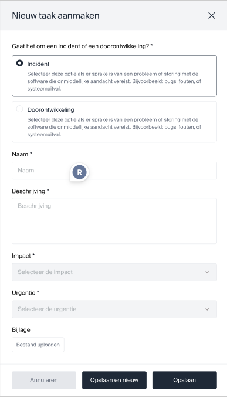
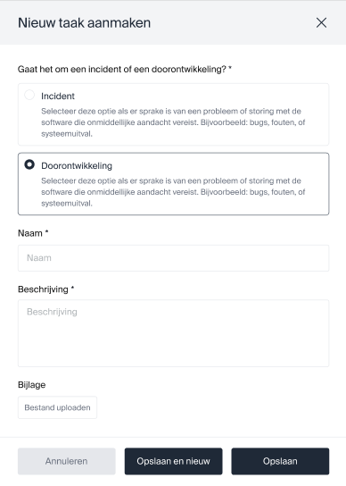
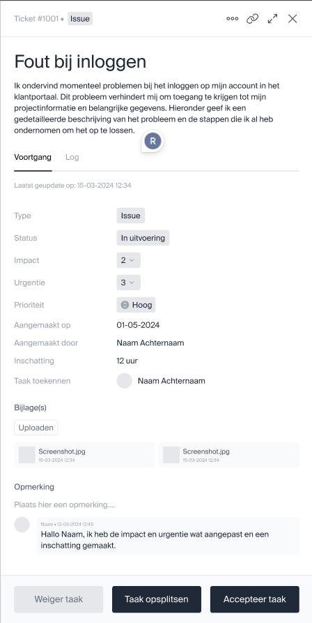
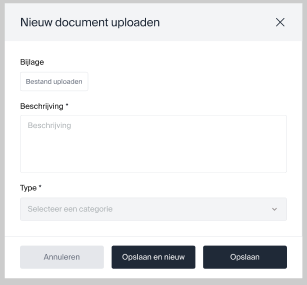
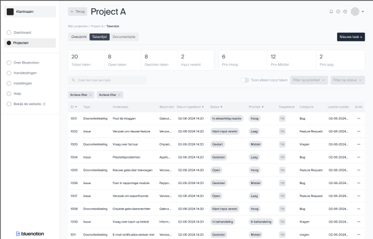

# Scherm ontwerpen

Naar vraag van Roel Dekkers, de inhouse UX designer zijn de bovengenoemde functionaliteiten ingedeeld ingedeeld per omgeving. Om groeperingen van de functionaliteiten binnen het programma en de interacties tussen de verschillende omgevingen zijn ze per 'pagina' gegroepeerd. Dit hoeven geen pagina's te zijn in de uiteindelijk te bouwen applicatie maar dienen als ondersteuning bij het UX ontwerp.

Naar vraag van Roel Dekkers, de inhouse UX designer zijn de functionaliteiten ingedeeld in verschillende omgevingen gebaseerd op de verschillende actors binnen dit project. Hierdoor zijn de volgende drie omgevingen uitgewerkt:

Algemeen: De omgeving waar een gebruiker zich in bevindt als hij/zij niet is aangemeld.

| Pagina  | Doel  | Oorsprong  |
|---|---|---|
| Registreren  | Het registreren van een nieuwe gebruiker in het PMP.  | [NFR4](./FunctioneelOntwerp.md#nonfunctional-requirements)  |
| Aanmelden  | Het aanmelden van een bestaande gebruiker in het PMP  | [NFR4](./FunctioneelOntwerp.md#nonfunctional-requirements)  |
| Wachtwoord vergeten  | Het resetten van een wachtwoord van een bestaande gebruiker in het PMP  | [NFR4](./FunctioneelOntwerp.md#nonfunctional-requirements)  |
| Over ons  | Een pagina met een korte omschrijving van Bluenotion en wat we doen  |   |
| Contact  | Contact informatie hoe mensen ons naast het PMP kunnen bereiken  |   |

Klant: De omgeving waar de gebruiker zich in bevindt als hij/zij is aangemeld als een admin van een project.

| Pagina  | Doel(en)  |
|---|---|
| [Mijn projecten pagina](#view2-mijn-projecten) | - Een globaal overzicht geven van de voor de klant beschikbare projecten. [FR1.1](./Requirements/FR1_Inzien_project_plannings_informatie.md#fr11-inzien-projecten)  - Om het extra duidelijk te maken voor de klant wanneer er iets van de klant wordt verwacht hier ook het lijstje met de "waiting for customer" lijst? [FR2.2](./Requirements/FR2_Inzien_taken.md#fr22-filteren-taken-op-waiting-for-feedback-internextern-open-stagingtesting-closed) |
| Project detail pagina  | - Een globaal overzicht geven van het door de klant geselecteerde project met snelle overzichten van de filters/lijstjes als beschreven in [FR2.2](./Requirements/FR2_Inzien_taken.md#fr22-filteren-taken-op-waiting-for-feedback-internextern-open-stagingtesting-closed)  -Overzicht van de voor het project relevante dependencies en services zoals beschreven in [FR6.1](./Requirements/FR6_Inzien_project_service_statuses.md#fr61-inzien-lijst-van-project-dependencies) en [FR6.2](./Requirements/FR6_Inzien_project_service_statuses.md#fr62-inzien-huidige-status-onlineoffline-project-dependencies).  - Optie voor een timeline of Gantt chart view? [FR2.4](./Requirements/FR2_Inzien_taken.md#fr24-tonen-taken-in-gantt-chart) |
| [Taken lijst pagina](#view6-takenoverview)  | - De taken lijstjes van de project detail pagina met extra informatie als wanneer er voor het laatst aan de taak is gewerkt, de datum waarop verwacht wordt dat de taak klaar is. [FR2.1](./Requirements/FR2_Inzien_taken.md#fr21-inzien-taken-van-project) & [FR2.2](./Requirements/FR2_Inzien_taken.md#fr22-filteren-taken-op-waiting-for-feedback-internextern-open-stagingtesting-closed) |
| [Taak detail pagina](#view3-taak-detail-view)  | - De pagina waar alle beschikbare informatie voor een taak te vinden is inclusief de aan de taak gekoppelde bijlages en comments. [FR2.3](./Requirements/FR2_Inzien_taken.md#fr23-inzien-taak-details)  - De gebruiker dient ook comments toe te kunnen voegen [FR3.2](./Requirements/FR3_Toevoegen_aanvraag.md#fr32-toelichting-geven-op-aanvraag) |
| [Toevoegen aanvraag pop-up/pagina/stappen&vragen](#view3-taak-detail-view)  | - Invoervelden waar de gebruiker een aanvraag kan doen. Invoer bestaat uit: naam, omschrijving, screenshot/bijlages, type (doorontwikkeling of issue), urgentie en impact (in geval van issue) [FR3.1](./Requirements/FR3_Toevoegen_aanvraag.md#fr31-toevoegen-nieuwe-aanvraag-in-een-project), [FR3.3](./Requirements/FR3_Toevoegen_aanvraag.md#fr33-toevoegen-taken-past-zich-aan-aan-de-klant-zijn-sla), [FR3.4](./Requirements/FR3_Toevoegen_aanvraag.md#fr34-toevoegen-bijlagen-bij-taak) |
| Aanpassen taak/aanvraag  | - Het aanpassen van een al toegevoegde taak of aanvraag. Zelfde invoer velden als Toevoegen aanvraag maar met ingevulde gegevens en de comments zoals op de taak detail pagina. [FR3.5](./Requirements/FR3_Toevoegen_aanvraag.md#fr35-aanpassen-taak-prioriteit)  |
| [Documentatie pagina](#view5-documentatie-view)  | - Een pagina waar de gebruiker voor het project beschikbaar gestelde documenten en tutorials kan bekijken/downloaden. [FR7.1](./Requirements/FR7_Inzien_project_documentatie.md#fr71-openendownloaden-document)  - Een zoek functie voor de documenten [FR7.2](./Requirements/FR7_Inzien_project_documentatie.md#fr72-filteren-documentnaamcategorie) |
| Chat venster  | - Een plek waar de gebruiker zijn* meest recente open en gesloten chats kan zien.   - Een plek waar de gebruiker berichten kan sturen naar Bluenotion medewerkers. |

Admin: De omgeving waar een gebruiker zich bevindt als hij/zij is aangemeld als admin van een organisatie.

| Pagina  | Doel(en)  |
|---|---|
| [Projecten pagina](#view2-company-admin)  | - Zelfde pagina als "Mijn projecten pagina" van de klant maar zonder filter op project eigenaar. [US4](./FunctioneelOntwerp.md#user-stories) |
| Tenant pagina | - Tonen tenant informatie en een lijst van alle projecten van deze tenant.   Tonen chat/communicatie met de tenant [FR9](./Requirements/FR9_Tenant_level_chat.md) |
| Project setup pagina  | - Het afhandelen van het proces dat met de klant wordt aangegaan voordat aan een project wordt begonnen. Nog niet verder uitgewerkt. [FR5.1](./Requirements/FR5_Opstellen_project.md#fr51-afhandelen-project-setup)  |
| Project dependencies pagina | - Het toevoegen, verwijderen of wijzigen van de dependencies/services van een project [FR5.3](./Requirements/FR5_Opstellen_project.md) |
| [Project documentatie pagina](#view5-documentatie-view)  | - Het toevoegen, verwijderen of wijzigen van aan een project gekoppelde documentatie en tutorials [FR5.3](./Requirements/FR5_Opstellen_project.md)   |
| [Taak detail pagina](#view3-taak-detail-view)  | - Controleren van een aanvraag met de mogelijkheid feedback te geven aan de klant (Zou voor de front-end kunnen via de zelfde pagina als die van de klant?)(FR8.1)   - Knop met accepteren/taak splitsen [FR8.2](./Requirements/FR8_Controleren_aanvraag.md#fr82-op-splitten-taak-naar-team-taken)  |
| Chat venster | - Een plek waar de gebruiker kan reageren op vragen gesteld door een klant. |
| Chat historie | - Een overzicht van alle gesloten en open chats van alle klanten? |

## Functionele requirements die worden aangekaart in de ontwerpen

Om te bewaken dat alle functionele requirements ook daadwerkelijk in de te maken software komen is een matrix gemaakt welk scherm interactie hebben met of informatie laten zien gerelateerd aan een functionele requirement. Daar waar requirements niet zijn opgenomen in de scherm ontwerpen dient een verantwoording voor opgegeven te worden.

|  | [FR1.1](./Requirements/FR1_Inzien_project_plannings_informatie.md#fr11-inzien-projecten) | [FR1.2](./Requirements/FR1_Inzien_project_plannings_informatie.md#fr12-inzien-totaal-geplande-urenkosten) | [FR2.1](./Requirements/FR2_Inzien_taken.md#fr21-inzien-taken-van-project) | [FR2.2](./Requirements/FR2_Inzien_taken.md#fr22-filteren-taken-op-waiting-for-feedback-internextern-open-stagingtesting-closed) | [FR2.3](./Requirements/FR2_Inzien_taken.md#fr23-inzien-taak-details) | [FR2.4](./Requirements/FR2_Inzien_taken.md#fr24-tonen-taken-in-gantt-chart) | FR2.7 | [FR3.1](./Requirements/FR3_Toevoegen_aanvraag.md#fr31-toevoegen-nieuwe-aanvraag-in-een-project) | [FR3.2](./Requirements/FR3_Toevoegen_aanvraag.md#fr32-toelichting-geven-op-aanvraag) | [FR3.3](./Requirements/FR3_Toevoegen_aanvraag.md#fr33-toevoegen-taken-past-zich-aan-aan-de-klant-zijn-sla) | [FR3.4](./Requirements/FR3_Toevoegen_aanvraag.md#fr34-toevoegen-bijlagen-bij-taak) | [FR3.5](./Requirements/FR3_Toevoegen_aanvraag.md#fr35-aanpassen-taak-prioriteit) | [FR3.6](./Requirements/FR3_Toevoegen_aanvraag.md#fr36-annuleren-aanvraag) | [FR4.1](./Requirements/FR4_Versturen_notificaties.md#fr41-inlichten-klant-wanneer-een-taak-wacht-op-input-van-de-klant) | [FR4.2](./Requirements/FR4_Versturen_notificaties.md#fr42-inlichten-bluenotion-bij-blockerscriticals) | [FR5.1](./Requirements/FR5_Opstellen_project.md#fr51-afhandelen-project-setup) | [FR5.2](./Requirements/FR5_Opstellen_project.md#fr52-instellen-productive-boards-en-taak-status) | [FR6.1](./Requirements/FR6_Inzien_project_service_statuses.md#fr61-inzien-lijst-van-project-dependencies) | [FR6.2](./Requirements/FR6_Inzien_project_service_statuses.md#fr62-inzien-huidige-status-onlineoffline-project-dependencies) | [FR5.3](./Requirements/FR5_Opstellen_project.md#fr53-beheren-project-services) | [FR7.1](./Requirements/FR7_Inzien_project_documentatie.md#fr71-openendownloaden-document) | [FR7.2](./Requirements/FR7_Inzien_project_documentatie.md#fr72-filteren-documentnaamcategorie) | [FR5.3](./Requirements/FR7_Inzien_project_documentatie.md#fr73-beheren-project-documentatie) | [FR8.1](./Requirements/FR8_Controleren_aanvraag.md#fr81-controleren-aanvraag) | [FR8.2](./Requirements/FR8_Controleren_aanvraag.md#fr82-op-splitten-taak-naar-team-taken) | [FR9.1](./Requirements/FR9_Tenant_level_chat.md#fr91-starten-nieuwe-chat) | [FR9.2](./Requirements/FR9_Tenant_level_chat.md#fr92-bericht-sturen-niet-afgesloten-chat) | [FR9.3](./Requirements/FR9_Tenant_level_chat.md#fr93-hervatten-afgesloten-chat) |
|---|---|---|---|---|---|---|---|---|---|---|---|---|---|---|---|---|---|---|---|---|---|---|---|---|---|---|---|---|
| [Klant: Mijn projecten pagina](#view2-mijn-projecten) |✓| | |✓| | | | | | | | | | | | | | | | | | | | | | | | |
| Klant: Project detail pagina | | | | | | | | | | | | | | | | | | | | | | | | | | | | |
| [Klant: Taken lijst pagina](#view6-takenoverview) | | |✓|✓| | | | | | | | | | | | | | | | | | | | | | | | |
| [Klant: Taak detail pagina](#view3-taak-detail-view) | | | | |✓| | | |✓| | | | | | | | | | | | | | | | | | | |
| [Klant: Toevoegen aanvraag pop-up/pagina/stappen&vragen](#view4-toevoegen-taak-view) | | | | | | | |✓| |✓|✓| | | | | | | | | | | | | | | | | |
| Klant: Aanpassen taak/aanvraag | | | | | | | | | | | |✓| | | | | | | | | | | | | | | | |
| [Klant: Documentatie pagina](#view5-documentatie-view) | | | | | | | | | | | | | | | | | | | | |✓|✓| | | | | | |
|  | | | | | | | | | | | | | | | | | | | | | | | | | | | | |
| [Admin: Projecten pagina](#view2-mijn-projecten) | | | | | | | | | | | | | | | | | | | | | | | | | | | | |
| Admin: Tenant pagina | | | | | | | | | | | | | | | | | | | | | | | | | |✓|✓|✓|
| Admin: Project setup pagina | | | | | | | | | | | | | | | |✓| | | | | | | | | | | | |
| Admin: Project dependencies pagina | | | | | | | | | | | | | | | | | | | |✓| | | | | | | | |
| [Admin: Project documentatie pagina](#view5-documentatie-view) | | | | | | | | | | | | | | | | | | | | | | |✓| | | | | |
| [Admin: Taak detail pagina](#view3-taak-detail-view) | | | | | | | | | | | | | | | | | | | | | | | | |✓| | | |
| Chat venster | | | | | | | | | | | | | | | | | | | | | | | | | |✓|✓|✓|
| Chat historie | | | | | | | | | | | | | | | | | | | | | | | | | | | | |

Missende elementen:

- FR3.6 annuleren aanvraag wel aanwezig in taak detail maar onbekende procedure.
- FR8.1 Zelfde als FR3.6
- FR4.1 Versturen notificatie komt nooit terug. Er zou mogelijk ergens een bericht moeten zijn dat een notificatie is verstuurd en/of is ontvangen.
- FR4.2 Inlichten Bluenotion zelfde als 4.1
- FR5.2 Instellen productive boards & taak status, Nieuwe functionaliteit. nog niet langs UX gegaan.
- FR6.1 & FR6.2 Inzien huidige service status, lage prio. nog niet langs UX gegaan.
- FR2.7 is een oude fr die is opgenomen in [FR2.1](./Requirements/FR2_Inzien_taken.md#fr21-inzien-taken-van-project)

## View1: Dashboard

- Toevoegen project dropdown?
- Defaults to "All" or "only project"
- Add pagination, search and filter to tickets component
- Add banner (zie "Klant>Mijn projecten")

| Wireframe | Scherm ontwerp | Realisatie |
|---|---|---|
|  |  |  |

projecId, naam, startdatum, update: projects endpoint

Project manager: People endpoint

Aantal taken: Tasks endpoint, grouped by project

Vereiste input: Tasks filter status

<!-- ### View1: Organization admin

### View1: Company admin

### View1: Organization employee

### View1: Company employee -->

## View2: Mijn projecten

### View2: Organization admin

Projectnaam, begindatum, einddatum, status: projects endpoint

Klantnaam: Company endpoint

Contactpersoon: People endpoint

<!-- budget, kosten, uren & uren: taken? -->

### View2: Company admin

ProjectId, naam, startdatum, update: projects endpoint

Project manager: People endpoint

Aantal taken: Tasks endpoint, grouped by project

Vereiste input: Tasks filter status

Prioriteit: ?

<!-- ### View2: Organization employee

### View2: Company employee -->

## View3: Taak detail view

Mijlpalen:

Mijlpalen is een keuze in te maken. De data over "mijlpalen" staat op het moment voor een taak en de workflow wordt bijgehouden door de PM. Zie [ADR008 Taak mijlpalen](../Technisch/ADRs/ADR008-Taak-Mijlpalen.md)

Taak id, type, onderwerp, beschrijving, datum ingediend, status, prio, inschatting tijd

Toegekend: Persons

Bijlagen: Attachments

Opmerkingen: Comments

Log: Activities

<!-- ### View3: Organization admin

### View3: Company admin

### View3: Organization employee

### View3: Company employee -->

## View4: Toevoegen taak view

Voor deze ontwerpen is weinig tot geen informatie nodig van Productive.

Controleren:

Taak id, type, onderwerp, beschrijving, datum ingediend, status, prio, inschatting tijd

Toegekend: Persons

Bijlagen: Attachments

Opmerkingen: Comments

Log: Activities

## View5: Documentatie view

## View6: TakenOverview

Taak id, type, onderwerp, beschrijving, datum ingediend, status, prio, laatste update: tasks endpoint

totaal taken, open taken gesloten taken, input vereist: tasks endpoint group by status

Toegekend: Persons endpoint

Prio hoog, prio middel, prio laag: tasks endpoint group by custom field*

## Componenten

Taken tellers

Taken lijst

Raakt:

- FR2: inzien taken

Feed

Project informatie

