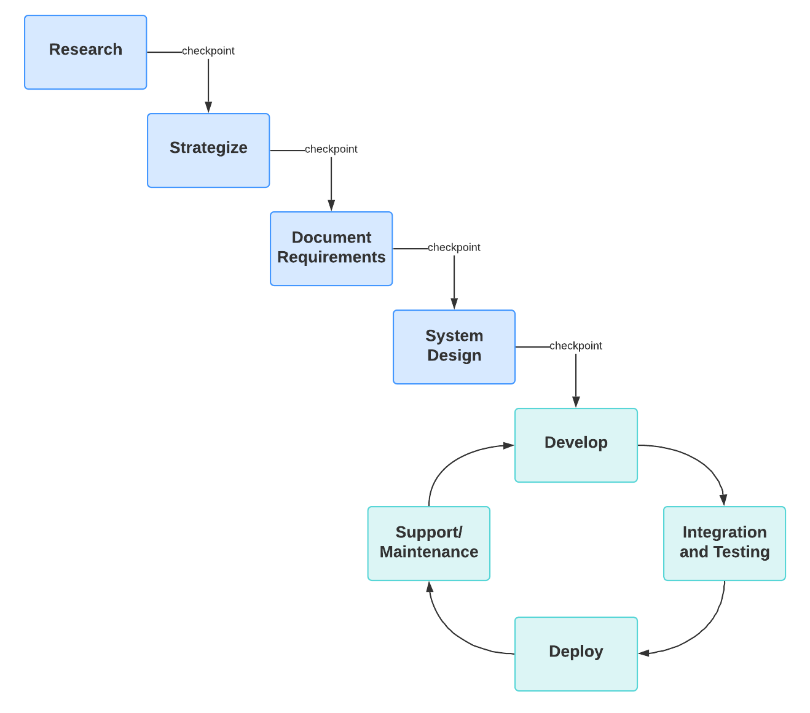

# Plan van aanpak Project Management Portal

<!-- TODO: weghalen voor online versie... -->


<!-- TODO: bron? -->

Naam: Daan Receveur

Studentnummer: 01642199

Versienummer: 1.2

Datum: 19-09-2024

Course: Afstuderen

Afstudeerbedrijf: Bluenotion

<div style="page-break-after: always;"></div>

## Inleiding

<!-- Binnen dit document wordt toelichting gegeven op de Project Management Portal dat als afstudeeropdracht ontwikkeld wordt voor Bluenotion. In de volgende hoofdstukken zal duidelijk gemaakt worden vanuit welke vraag de opdracht is ontstaan, het doel van de opdracht en worden verwachtingen geschept van de concreet te leveren producten, de kwaliteitseisen hiervan en hoe deze eisen bereikt dienen te worden. -->

Binnen dit document wordt toelichting gegeven op het ontwikkelplan van het project management portal dat door Daan Receveur als afstudeer opdracht wordt ontwikkeld in opdracht van Bluenotion. Binnen dit portal dienen klanten van Bluenotion inzicht te krijgen in en invloed te kunnen uitoefenen over de projectplanning van de projecten die ze bij Bluenotion hebben lopen.

<!-- TODO: waarschijnlijk nog steeds te kort -->

<div style="page-break-after: always;"></div>

## Achtergrond van het project

Binnen dit hoofdstuk wordt toegelicht voor wie de opdracht uitgevoerd wordt, hoe de opdracht tot stand is gekomen en welke stakeholders baat hebben bij het uiteindelijk op te leveren softwarepakket.

### Organisatie

Bluenotion is een bedrijf met +/- 20 medewerkers dat in opdracht van de klant met verschillende ontwikkel methodes maatwerk software levert. Dit houdt in dat er op elk moment bij Bluenotion met dynamische teams voor verschillende opdrachtgevers aan verschillende (vaak kortdurende) projecten wordt gewerkt.

Doorgaans wordt door een Project Manager (PM) en Tech Lead (TL) voor een (nieuw of bestaand) project een scope opgezet met een estimate van hoe veel uur Bluenotion verwacht eraan kwijt te zijn. Na akkoord van de klant wijst de PM een aantal medewerkers met verschillende relevante expertises toe aan het project om het product van de scope te realiseren.

```puml
rectangle CEO
rectangle Finance 
rectangle "Operationeel management" as OM
rectangle HR

rectangle "Project technisch/management" as PTM

rectangle Development

rectangle "User experience" as UX
rectangle "Front-end" as FE
rectangle "Back-end" as BE

CEO -- Finance
CEO -- OM
CEO -- HR

OM--PTM
PTM--Development

Development--UX
Development--FE
Development--BE
note bottom
    Daan Receveur
end note
```

*Fig 1: Organigram*

### Aanleiding voor het project

<!-- TODO: lage prioriteit was niek het niet mee eens -->

Met deze projectmatige wijze van maatwerk softwareoplossingen leveren is het belangrijk dat de klant en Project technisch/management snel en duidelijk over de scope van taken en sprints kunnen communiceren. Op het moment maakt Bluenotion gebruik van een combinatie van Excel bestanden en Productive.io voor het beheer van de sprint planningen en uit te voeren taken.

Er zijn op het moment twee voornamelijke manieren waarop de klant op de hoogte wordt gebracht van de status van de uit te voeren taken:

- Directe communicatie via de PM:
Voor de meeste projecten dient de projectmanager als koppeling tussen klant en development team. Het is dan aan de projectmanager om de huidige staat van het project tijdens vaste contactmomenten te communiceren en waar nodig nieuwe taken aan te maken voor het verwerken van feedback van de klant of het creëren van nieuwe functionaliteiten.
- Guest account in Productive:
Voor een aantal projecten zijn aan de klant accounts beschikbaar gesteld waarin ze direct inzicht kunnen krijgen in de status van het bouwproces. Hiermee kunnen ze real-time inzicht krijgen over de staat van het project en waar nodig zelf taken inschieten.

<!-- Met deze projectmatige wijze van maatwerk softwareoplossingen leveren heeft Bluenotion ondervonden dat de opdrachtgever bij het bouwproces betrekken een positieve invloed heeft op het algemene ontwikkelproces. -->

Beiden manieren worden door Project technisch/management van Bluenotion en de klant op verschillende vlakken als nadelig ervaren. Zo zijn de projectmanagers dagelijks veel tijd kwijt aan het beantwoorden van de vragen van klanten die willen weten wanneer een bepaalde feature klaar is, bug is opgelost of over en weer mailen om nieuwe functionaliteit duidelijk te krijgen. Bij klanten die een Productive guest account hebben gekregen maar verder geen ervaring hebben met producten als Productive.io wordt Productive als onduidelijk ervaren en krijgt Bluenotion de feedback dat de informatie op Productive als overwelmend wordt ervaren.

Om deze redenen wil Bluenotion een eigen systeem waar de klant inzicht kan krijgen in de huidige status van zijn/haar project om de werkdruk van de PM te verlagen en waar de klant nieuwe taken kan inschieten of feedback kan geven op al bestaande taken wanneer er bijvoorbeeld nieuwe UX ontwerpen zijn gemaakt zodat de klant van kop tot staart betrokken kan zijn bij het ontwikkel traject.

Met zicht op de groei van het bedrijf wil Bluenotion de hierboven communicatiekanalen tussen de PM en de klant stroomlijnen op een wijze waardoor de development teams binnen Bluenotion hun werkwijze niet hoeven aan te passen.

### Initiële opdracht

De oorspronkelijke opdracht omschrijving luidt dan ook als volgt:

>Ontwikkel een systeem waarin de klant inzicht kan krijgen in en wijzigingen kan aanvragen op de planningen voor de voor hun relevante projecten. Dit systeem dient gekoppeld te worden aan de huidig gebruikte projectmanagement software zonder de huidige workflow te belemmeren.

### Stakeholders

**Externe klant:** De klant van Bluenotion is de persoon/groep personen die een project laten uitvoeren door Bluenotion. Hiervoor willen ze requirements voor de te maken software vastleggen, live updates krijgen over wanneer aan taken gewerkt wordt en weten wanneer er goedkeuring gevraagd wordt van Bluenotion over bijvoorbeeld time/cost estimates of UX-designs.

**PM & TL:** De Projectmanagers en Tech Leads hebben binnen Bluenotion een rol in het maken van de taken, planningen en de bijbehorende time/cost estimates. Ook zijn deze stakeholders op het moment voornamelijk verantwoordelijk voor het communiceren van de huidige status van taken naar de klant indien de klant hiernaar vraagt.

**Software developers:** De software developers binnen Bluenotion zouden bij een goede uitvoering van het project geen interactie hoeven te hebben met het te bouwen portaal. Wel dienen software developers binnen Productive op de hoogte gebracht te worden over functionele onderhandelingen tussen de PM en klant, over en weer gestuurde screenshots en zouden handelingen die software developers uitvoeren op taken binnen Productive gereflecteerd moeten worden in het te bouwen portaal.

<div style="page-break-after: always;"></div>

## Doelstelling, opdracht & op te leveren resultaten

Binnen dit hoofdstuk wordt toegelicht welke delen in het huidig proces ervaren kunnen worden als probleem of uitdaging, wat het doel van Bluenotion is met deze opdracht, de opdrachtomschrijving en een korte omschrijving van het uiteindelijk te leveren softwarepakket.

### Probleem/uitdaging

De twee kanalen die worden gebruikt voor communicatie tussen Bluenotion en haar klanten laten zoals in [de aanleiding van het project](#aanleiding-voor-het-project) gemeld op gebied van duidelijkheid en werkdruk te wensen over. Hierdoor zijn projectmanagers en tech leads relatief veel tijd kwijt aan het mailen en bellen van de klant wanneer taken onduidelijk zijn of wanneer een klant feedback dient te geven op het verloop van een taak en raken klanten gefrustreerd over het gebrek aan overzicht van hun project en uit te voeren acties.

<!-- TODO: dit is verhuisd naar aanleiding voor het project

Op het moment worden te verrichte taken voor het bouwen van de softwareoplossingen bijgehouden in productive.io. De status van het project en de bijbehorende taken worden voornamelijk op de volgende twee manieren gecommuniceerd:

- Directe communicatie via de PM:
Voor de meeste projecten dient de projectmanager als koppeling tussen klant en development team. Het is dan aan de projectmanager om de huidige staat van het project tijdens vaste contactmomenten te communiceren en waar nodig nieuwe taken aan te maken voor het verwerken van feedback van de klant of het creëren van nieuwe functionaliteiten.
- Guest account in Productive:
Voor een aantal projecten zijn aan de klant accounts beschikbaar gesteld waarin ze direct inzicht kunnen krijgen in de status van het bouwproces. Hiermee kunnen ze real-time inzicht krijgen over de staat van het project en waar nodig zelf taken inschieten.

Beide manieren van het communiceren van de project status brengen voor- en nadelen met zich mee.

Het management volledig overlaten aan de projectmanager heeft als resultaat dat de klant geen direct eenduidig overzicht heeft van de status van zijn/haar project en wanneer hij/zij dit wel wil wordt de werkdruk van de PM verhoogd.

Productive.io accounts beschikbaar stellen voor de klant heeft als resultaat dat de klant voor Bluenotion op een niet-Bluenotion portal terecht komt waar de data ongefilterd en voor klanten mogelijk onduidelijk beschikbaar is. Per klant verschilt of dit leidt tot vragen over bestaande taken en incorrect toegevoegde nieuwe taken. -->

### Doelstelling

Aangezien Bluenotion voornamelijk maatwerk software bouwt wil Bluenotion dat de klant en ontwikkelaar in co-creatie samenwerken om tot de vereiste digitale oplossing te komen.

<div style="page-break-after: always;"></div>

### Opdracht

Hiervoor dient een centraal portal gebouwd te worden waar zowel de klant en medewerkers van Bluenotion kunnen werken aan dezelfde projecten. Het PMP zal aan de hand van de onderstaande punten meehelpen aan deze doelstelling:

- De klantvriendelijkheid te vergroten.

    Door de transparantie naar de klant te vergroten en de klant zelf te laten meewerken aan de planning van het project wordt de klantvriendelijkheid vergroot.

- Als centraal overzicht voor de PM/Klant.

    Door de klant en de PM beiden via dezelfde portal te laten werken is het voor beiden partijen sneller duidelijk wat er gedaan moet worden en waar de ander vragen of opmerkingen over heeft.

- Communicatiekanaal voor de PM/Klant.

    Door de communicatie over het aanmaken of prioriteren van taken via het PMP te laten lopen is het voor beide partijen gelijk inzichtelijk waar de ander het over heeft.

- Stroomlijnen development proces.

    Door de klant meer input te geven over het planningsproces is de hoop dat onduidelijke taken verduidelijkt worden voordat ze bij developers terecht komen.

- Borgen van kennis over projecten.

    Kennis als handleidingen of deployment informatie kunnen aangeleverd worden op dezelfde plek als waar de klant inzicht heeft in de ontwikkeling van het project.

### Concrete resultaten

Een applicatie met een C# back-end (.NET), Typescript front-end (React Native) waar een externe beheerder of interne PM de huidige staat van projecten zijn/haar kan inzien en/of nieuwe taken kan inschieten. De te maken applicatie dient informatie over projecten en de bijbehorende tickets inzichtelijk te maken voor de klant van Bluenotion en communicatiekanalen te bieden die de klant betrekken in het proces vanaf het indienen van een aanvraag tot de deployment op de live omgeving van de klant.

Het gebruik van .NET en React Native staat niet vast, als er tijdens de loop van het project goede argumenten zijn voor het gebruik van andere frameworks en/of talen kan ervan af gestapt worden. Aangezien er inhouse veel kennis is en doorgaans gewerkt wordt met .NET back-end en React front-end is voor de onderhoudbaarheid de keuze gemaakt dit ook als uitgangspunt te nemen.

<div style="page-break-after: always;"></div>

## Project grenzen

- De projectmanagement portal wordt niet ontwikkeld als vervanging van Productive.io voor het development team. Enkel voor de communicatie tussen de klant en de PM/TL.
- Het project wordt in ieder geval door ontwikkeld tot 25-01-2025.
- De applicatie wordt niet voor mobiele apparaten ontwikkeld.
- De applicatie wordt niet voor andere talen ontwikkeld dan Nederlands en Engels.
<!-- TODO: Meer project grenzen... -->

## Randvoorwaarden

- Bluenotion levert na akkoord op de software architectuur de infrastructuur waar het PMP kan draaien.
- Bluenotion levert een werkplek met laptop waar aan het PMP gewerkt kan worden.
- Bluenotion stelt op zijn minst 1x in de 2 weken een medewerker beschikbaar voor het geven van feedback op het project.
- Bluenotion stelt een Productive account beschikbaar met de juiste rechten om de gevraagde functionaliteit te behalen.
- Bluenotion stelt collega's beschikbaar voor overleg, feedback en tips zoals omschreven in dit document onder [ontwikkelmethoden.](#ontwikkelmethoden)

<div style="page-break-after: always;"></div>

## Op te leveren producten en kwaliteitseisen en uit te voeren activiteiten

Binnen dit project worden de volgende producten opgeleverd.

| Product  | ProductKwaliteitseisen  | Benodigde activiteiten om te komen tot het product  | Proceskwaliteit (5 x W 1 x H)  |
|---|---|---|---|
| Code eindproduct  | - Code & comments worden in het engels te schrijven</br> - Code is herleidbaar naar oorsprong in het FO/TO</br> - Er wordt waar praktisch mogelijk rekening gehouden met [CLEAN](https://refactoring.guru/refactoring/what-is-refactoring)(Refactoring.Guru, z.d.) en [SOLID](https://www.digitalocean.com/community/conceptual-articles/s-o-l-i-d-the-first-five-principles-of-object-oriented-design) coding principles.(SOLID: The First 5 Principles Of Object Oriented Design \| DigitalOcean, z.d.)</br> - Frontend code wordt geanalyseerd door [ESLint](https://eslint.org/).</br> - Backend code wordt geanalyseerd door [StyleCop](https://github.com/StyleCop/StyleCop).</br> - Code formatting wordt gedaan aan de hand van Editorconfig en prettier.  | - Voordat logica geschreven wordt worden alle relevante constructors en functie signatures klaargezet met de oorsprong in comments boven de signature.</br> - ESLint, StyleCop, Editorconfig en Prettier dienen geïnstalleerd en gebruikt te worden.  | - De developer vergelijkt voor het maken van wijzigingen de gevraagde functionaliteit met de [DoR](./kwaliteitseisen.md#definition-of-ready)</br> - De developer vergelijkt de gemaakte wijzigingen voor elk pull request met de [DoD](kwaliteitseisen.md#definition-of-done) om te bevestigen dat alle afgesproken punten geraakt zijn.</br> - De developer schrijft wanneer functionaliteit op de sprint planning staat code om de functionaliteit te realiseren. |
| Plan van aanpak  | - De opdrachtgever heeft afgetekend op het plan van aanpak. </br>- Geeft inzicht over de achtergrond, doelstelling en op te leveren resultaten van het project.</br>- Baken het project af met duidelijke project grenzen en randvoorwaarden.</br>- Op te leveren producten, kwaliteitseisen en uit te voeren activiteiten zijn aan de hand van [SMAR(T)](https://en.wikipedia.org/wiki/SMART_criteria)(Robertlbogue, 2007) en [5xW 1xH beschreven](https://www.lean.nl/wat-is-de-5-x-w-1h-doorvraag-methode-green-belt/)(Admin, 2024).</br>- De ontwikkelmethodiek is vastgelegd</br>- Voor elke tijdens de stage relevante partij zijn contactgegevens vastgelegd.</br>- Er is een globale planning aanwezig met alle aan te leveren producten.</br>- Risico’s zijn vastgelegd met tegen maatregels en uitwijk strategieën</br> - Voldoet aan de [AIM controle kaart](./AIMControlekaart.md)  | - Bespreking project met PM en TL om de informatie voor het document te verzamelen </br>- Aan de hand van de PvA handleiding van de HAN (HAN, 2024) het document schrijven.  | - De developer zet in de eerste sprint het PvA op en loopt deze met de opdrachtgever door in de sprint review. </br>- Bespreking met PM die het systeem zou gebruiken de functionele aspecten van het project te controleren.</br> - Bespreking met TL om de technische aspecten van het project te controleren.  |
| Functioneel Ontwerp  | - Bevat een genummerde lijst van alle voor het project relevante stakeholders.</br>- Bevat een genummerde lijst van alle Functionele en non-functionele wensen volgens FURPS+(FURPS+, z.d.)</br> - Bevat de happy flow van de software in wireframes/mockups</br> -Bevat een Usecase diagram</br> -Bevat een domein model</br> -Functionele requirements zijn uitgewerkt naar fully dressed usecases (Studocu, z.d.)</br> -Bevat alternative flows die als relevant worden beoordeeld door de opdrachtgever, productmanager of techlead. </br>- Bevat een deployment diagram (GeeksforGeeks, 2024) met de voorgestelde omgeving waar het PMP in draait.   | - Gesprek met opdrachtgever om de wensen en stakeholders vast te leggen.</br> - (Optioneel) Gesprek met verdere stakeholders voor verduidelijking wensen.</br> - Gesprek met collega’s van UX om tot goed te gebruiken mockups te komen.</br> - Domein model maken op basis UX en gesprek opdrachtgever/stakeholders.</br> - Wensen opdelen in functioneel en non-functioneel</br> - Functionele wensen vastleggen in fully dressed usecases met [MoSCoW](https://www.productplan.com/glossary/moscow-prioritization/) prioritering.(MOSCOW Prioritization, 2022)  | - Aanpassingen binnen het document dienen gecontroleerd te worden aan de hand van de [DoR](kwaliteitseisen.md#definition-of-ready)</br> - Tijdens de sprint reviews dient het document als basis voor de presentatie tegenover de opdrachtgever.</br> - Wijzigingen en het FO en TO worden direct meegenomen in PR's die de wijzigingen doen.  |
| Onderzoek: Productive communicatie  | Beantwoord in ieder geval de vragen uit Bijlage 3: Onderzoeksvragen</br> - Wordt uitgevoerd volgens het [choosing fitting technology](https://ictresearchmethods.nl/patterns/choose-fitting-technology/) research pattern.</br> - Produceert een testplan om de resultaten van het onderzoek in het Proof of Concept te bevestigen of ontkrachtigen.  | - Vergelijking tussen gewenste data stakeholders en aangeboden data Productive API. </br>- Verschillende voorstellen voor data synchronisatie tussen de systemen op basis van FR's en NFR's. | - Voor het starten van het onderzoek dienen de FR's en NFR's goedgekeurd te worden door de PM en TL. </br>- Voor het PoC wordt gebouwd voor de potentiële oplossing dient een testplan opgezet te worden met meetbare eisen. |
| PoC: Productive communicatie | - Houdt zich aan de alle NFR's.</br> - Bevat functionaliteit waarmee in ieder geval taak data van Productive naar een lokale database wordt weggeschreven.</br> - Bevat functionaliteit waarmee lokaal taken aangemaakt kunnen worden die gesynchroniseerd worden naar Productive. | - Antwoord op de vragen zoals besproken in het Onderzoek over Productive communicatie</br>- Een testplan met meetbare acceptatiecriteria. | - Na het beantwoorden van de vragen van het Productive communicatieonderzoek zet de developer een proof of concept synchronisatie module die de data aan de hand van de in het onderzoek gekozen methodiek synchroniseert met een lokale database om de communicatie met Productive gescheiden van de rest van de applicatie te ontwikkelen. |
| Technisch ontwerp  | - Bevat een klasse diagram die overeenkomt met de software in zijn huidige staat.</br> - Bevat een package diagram die overeenkomt met de software in zijn huidige staat.</br> - Bevat een deployment diagram die overeenkomt met de software in zijn huidige staat.</br> - Bevat een Database model die de huidige staat van de database representeert.</br> - Bevat een API-definitie met alle binnen de applicatie beschikbare end-points en de relevante producers/consumers.  | - Maak een klasse diagram aan op basis van het domeinmodel en de initiële wensen.</br> - Maak een package diagram aan op basis van gekozen software architectuur.</br> - Maak een deployment diagram aan op basis van de gekozen software architectuur</br> - Maak een database model aan op basis van het domeinmodel en de in het FO aanwezige wensen.</br> - Maak een API-definitie voor elk blootgestelde endpoint. </br> - Werk het klasse diagram bij wanneer functionaliteiten hier wijzigingen in aanbrengen ([DoD](kwaliteitseisen.md#definition-of-done)).  | Wijzigingen en het FO en TO worden direct meegenomen in PR's die de wijzigingen doen.</br> - Wanneer een taak resulteert in wijzigingen in een van de in het TO aanwezige diagrammen dienen deze diagrammen en de bijbehorende toelichting bijgewerkt te worden voor de taak af is ([DoD](kwaliteitseisen.md#definition-of-done))  |
| Software architecture document  | - Bevat een globaal overzicht van het systeem en de data flows die hierin voorkomen volgens het [4C model](https://c4model.com/).(The C4 Model For Visualising Software Architecture, z.d.)</br> - Bevat verantwoording voor alle [architecturaal relevante gemaakte keuzes](https://medium.com/oolooroo/a-step-wise-guide-to-architectural-decisions-ee7304871a71)(Paradkar, 2023) binnen het project.</br> - Bevat een overzicht van alle Architectural Relevant Decisions  | - De globale dataflow dient vastgelegd te worden na het vaststellen van de eerste requirements van de software.</br> - Wanneer een architecturaal relevante beslissing wordt genomen dient deze de dag zelf nog in het SAD gezet te worden.  | Het SAD dient over de levensduur van het project geüpdatet te worden volgens het [TwinPeaks Model](https://www.microtool.de/en/knowledge-base/what-is-the-twin-peaks-model/). (Haefke, 2024)</br> - De developer schrijft na het nemen van een beslissing een Architectural Decision Record (ADR) volgens de omschrijving op [cognitect](https://cognitect.com/blog/2011/11/15/documenting-architecture-decisions) een ADR. |
| Testplan & Testrapport  | - Het test plan bevat aan het eind van elke sprint een accurate representatie van welke functionele en niet functionele eisen binnen het project af zijn en waarom wel/niet.</br> - Het testplan bevat voor elke usecase de happy flow.</br> - Het testplan bevat alternative flows voor scenario’s waar de opdrachtgever dit belangrijk acht.  | - In het testplan worden happy flows opgenomen zodra de bijbehorende usecases “Done” zijn.</br> - Alternative flows worden overlegd met de opdrachtgever, techlead of productmanager en indien ze complex zijn of om andere reden er een wens is alt flows toe te lichten worden ze meegenomen in het FO en Testrapport.  | - Het testrapport wordt door de developer op de laatste dag van elke sprint opnieuw ingevuld met resultaten van de automatische en functionele tests.  |
| Afstudeerverslag | - Het afstudeerverslag is niet langer dan 6.000 woorden of 15 pagina's (exclusief samenvatting, inhoudsopgave, bronvermeldingen en bijlagen)</br> - Alle beoordelingscriteria (BC1 tm BC5) uit het beoordelingsformulier afstuderen ICT 2020-2021 van de Afstudeerhandleiding HBO-ICT en CMD 2024-2026 zijn met een voldoende afgevinkt. </br> - Voldoet aan de [AIM controle kaart](./AIMControlekaart.md) | - Woorden & pagina teller in de gaten houden tijdens het schrijven van het verslag </br> - Feedback vragen aan de docent begeleider </br>- Ingevuld beoordelingsformulier afstuderen ICT 2020-2021 | - Voor het inleveren van het afstudeerverslag vult de afstudeerder het beoordelingsformulier in naar eigen inzicht en voegt hij deze bij als bijlagen zodat de assessor een beeld kan vormen bij de mening van de afstudeerder over zijn eigen werk. </br>- De beoordeling criteria en bijbehorende prestatie criteria in een verslag template zetten aan het begin van de stage en wanneer ze aan bod komen de bijbehorende hoofdstukken aanvullen. </br>- Indien halverwege de stage BC's of PC's blijven nog niet ingevuld zijn dit aangeven bij de bedrijf of docent begeleider met vraag om advies dit te rectificeren. </br>- Elke vrijdag de tijd nemen belangrijke informatie weg te schrijven in het afstudeerverslag |
| Eindpresentatie  | - Er wordt een presentatie gegeven van 20 tot 30 minuten over het afstudeerproject | - Het stageverslag maken.</br> - Presentatie voorbereiden | - Aan het eind van de stage het proces als vastgelegd in het afstudeerverslag in een powerpoint zetten. |
<!-- | Opleverdocument | - Bevat een kort overzicht van de aangeleverde software en de bijbehorende functionaliteiten op basis van het testrapport. </br>- Bevat een deployment diagram met stappenplan om de software vanaf niets op te zetten. </br>- Bevat een kort overzicht van eventuele toekomstige uitbreidingen. | - Testrapport maken en invullen</br>- Functionaliteiten lijst nalopen met implementatie status</br>- Deployment instructies schrijven</br>- Samenvatten van belangrijke beslissingen uit het SAD, FO en TO</br>- Noteren potentiële aandachtspunten en uitbreidingsmogelijkheden | - In sprint 9 de gemaakte software vergelijken met de gemaakte documentatie en de hiervoor genoemde punten nalopen. | -->

*Table 1: Product kwaliteitseisen*

<div style="page-break-after: always;"></div>

## Ontwikkelmethoden

Het project wordt voornamelijk door één software developer uitgevoerd. Daar waar gewenst zijn binnen Bluenotion collega's beschikbaar voor feedback en tips op het gebied van projectmanagement, UX, FE en het programmeren zelf maar deze collega's zijn in hun dagelijks werk aan het werk aan andere projecten.

Binnen Bluenotion wordt er een vereenvoudigde versie van SCRUM gehanteerd waar wel op een iteratieve wijze aan projecten wordt gewerkt maar een boel scrum rollen en ceremonies uit het [SCRUM manifesto](https://agilescrumgroup.nl/scrum-manifesto/) wegens tijdsbesparing en vermindering van complexiteit niet worden vervuld.

Voor het afstudeerproject dien ik in 18 weken voornamelijk in mijn eentje een softwareoplossing neer te zetten. Op het begin van het project staat de kern van wat er over 18 weken moet staan redelijk vast maar staan er een aantal technische vragen (onderzoek productive) open en zijn niet alle functionele eisen even compleet uitgelegd omdat er tijdens de toelichting over het project ook uitbreidingsplannen zijn besproken.

Om bij het afstudeerproject vroegtijdig project kritische aspecten te kunnen identificeren maar flexibiliteit te kunnen houden om onduidelijk beschreven (of nieuwe) functionaliteiten te kunnen implementeren is er gekozen voor een mix tussen agile en waterval, ook wel de [Hybride agile-watervalmethode](https://www.lucidchart.com/blog/nl/agile-waterval-hybride) genoemd.

Een hybride agile waterval methode kan op verschillende manieren ingezet worden. De manier waarop in dit project wordt gewerkt met de agile waterval is als volgt:


*Fig 2: agile waterval*
<!-- TODO: Bron agile waterval https://www.lucidchart.com/blog/nl/agile-waterval-hybride  -->

Zoals in de bovenstaande afbeelding aangegeven begint de methode met een kleine waterval waarin onderzoek wordt gedaan naar wat (en hoe) het systeem dient te functioneren. Tijdens deze waterval wordt voor de stakeholders een overkoepelend beeld geschetst van de functionele en niet functionele eisen aan het systeem maar worden vooral ook de risico's en onzekerheden binnen het project vastgelegd. Hiermee wordt op een vroeg stadium duidelijk wat potentiële limitaties zijn zodat dit niet in een latere sprint als "verrassing" terugkomt.

Nadat het initiële software ontwerp is gemaakt wordt er overgeschakeld naar een agile methode. In het geval van dit afstudeerproject wordt hier gebruik gemaakt van de vereenvoudigde versie van SCRUM die binnen Bluenotion gehanteerd wordt.

De reden dat er eerst gewerkt wordt met een korte waterval is om een globaal beeld te krijgen van de functionaliteiten die voor het portaal nu en potentieel in de toekomst gewenst zijn maar vooral ook zodat eerst een goed onderzoek gedaan kan worden naar de wijze waarop het portaal met de Productive API gaat communiceren. Met de [rate limits](https://developer.productive.io/#header-rate-limits) die op de Productive API gehanteerd worden zou het voor een applicatie met weinig gebruikers mogelijk zijn om hier direct mee te communiceren. Binnen de initiële waterval worden de functionaliteiten van het project verzameld waarmee een concreter beeld geschetst kan worden van de potentiële data flow tussen de twee applicaties. Hierna wordt aan de hand van een onderzoek en proof of concept een wijze van caching of database synchronisatie uit gepland en uitgewerkt tot een proof of concept module waar de rest van de applicatie op kan doorbouwen.

Nadat er een standaard wijze voor efficient data ontvangen en versturen van en naar Productive worden de rest van de functionaliteiten binnen de vereenvoudigde versie van SCRUM die grotendeels binnen Bluenotion gehanteerd wordt uitgewerkt.

De punten die overgenomen worden van SCRUM zijn:

Sprint retrospective:

Zolang er niet regelmatig binnen een team wordt gewerkt wordt ook de retrospective niet meegenomen als aparte ceremonie. Dit omdat er tijdens de retrospective wordt gereflecteerd op het handelen en samenwerken van het team. Om de waarde van de retrospective toch niet volledig te niet te doen krijgen de bedrijfsbegeleider en opdrachtgever (beiden stakeholders van het PMP) aan het eind van sprint review het verzoek het liefst aan de hand van de [zeester methode](https://insightful.be/ontdek-de-starfish-retrospective-methode/) feedback te geven op de kwaliteit van de doorlopen processen.

Sprint review:

De sprint review wordt grotendeels gehouden zoals beschreven in het [SCRUM manifesto](https://agilescrumgroup.nl/scrum-manifesto/). De in de afgelopen sprint gemaakte functionaliteit wordt aan de stakeholders voorgelegd met de vraag hier feedback op te geven. Hierna wordt samen met de stakeholders een planning opgezet voor de volgende sprint en de functionaliteiten die de stakeholders graag zouden willen zien in de volgende sprint. Door deze twee acties wordt er over de loop van het project oog gehouden op of het geleverde werk overeenkomt met de wensen van de opdrachtgever en de andere stakeholders.

backlog:

Binnen dit project wordt gebruik gemaakt van een project backlog en sprint backlog om in beeld te houden welke taken nog voor het project gedaan moeten worden en wat er op de planning staat voor de huidige sprint. De sprint backlog wordt in overleg met de opdrachtgever tijdens de sprint review besproken.

Definition of Ready (DoR) & Definition of Done (DoD):

De DoD en DoR bevatten definities voor wanneer er aan een taak of functionaliteit begonnen mag worden en wanneer deze klaar is. Omdat deze twee doelen los van elkaar staan kan het voor komen dat een taak in de ene sprint Ready dient te zijn maar pas de volgende sprint Done.

De DoR heeft voornamelijk betrekking op documentatie die gemaakt dient te worden om de functionaliteit naar de stakeholders te kunnen communiceren. Het doel hiervan is voordat er functionaliteit uitgewerkt wordt duidelijk met de stakeholders te kunnen communiceren over wat wanneer waarom gemaakt wordt.

De DoD bevat definities voor wanneer een functionaliteit klaar is. Hier wordt meer ingegaan op de code en technische documentatie dan in de DoR. Het doel van de DoR is het testen van de geleverde functionaliteit, onderhouden van de code kwaliteit en garanderen van de traceability tussen code en documentatie.

<!-- TODO: bron dod dor -->

<!-- https://www.lucidchart.com/blog/nl/agile-waterval-hybride -->

<div style="page-break-after: always;"></div>

## Projectorganisatie en communicatie

| Rol(len): | **Student** |
|---|---|
| Naam: | Daan Receveur |
| Contactgegevens: | <daan@bluenotion.nl> |
| Contactmomenten: | Maandag tm vrijdag 9 tm 17:30 |
| Verantwoordelijkheden | - Plannen en uitvoeren van het afstudeerproject. </br> - Plannen van de begeleidingsafspraken en communicatie met de docentbegeleider en bedrijfsbegeleider. |

| Rol(len): | **Bedrijfsbegeleider** |
|---|---|
| Naam: | Yannic Smeets |
| Contactgegevens: | <yannic@bluenotion.nl> |
| Contactmomenten | Sprint review |
| verantwoordelijkheden | Feedback/mogelijkheid tot sparren over technische aspecten van het project. |

| Rol(len): | **Opdrachtgever** |
|---|---|
| Naam: | Jesse Bekke |
| Contactgegevens: | <jesse@bluenotion.nl> |
| Contactmomenten: | Sprint review |
| verantwoordelijkheden: | Feedback/mogelijkheid tot sparren over functionele aspecten van het project. |

| Rol(len): | **UX Designer** |
|---|---|
| Naam: | Roel Dekkers |
| Contactgegevens: | <Roel@bluenotion.nl> |
| Contactmomenten | Op aanvraag |
| verantwoordelijkheden | Brainstormen en feedback leveren op de user experience |

| Rol(len): | **FE Developer** |
|---|---|
| Naam: | Jelle Streefkerk |
| Contactgegevens: | <Jelle@bluenotion.nl> |
| Contactmomenten | Op aanvraag |
| verantwoordelijkheden | Brainstormen en feedback leveren op de development van de FE |

| Rol(len): | **Docentbegeleider** |
|---|---|
| Naam: | Niek van Diepen |
| Contactgegevens: | <Niek.vanDiepen@han.nl> |
| Contactmomenten | Op aanvraag |
| verantwoordelijkheden | Voor beoordeling van de beroepsproducten en afstudeerverslagen. |

<div style="page-break-after: always;"></div>

## Planning

Zoals besproken in het hoofdstuk Ontwikkelmethoden hebben sprints een duur van 2 werkweken, met een stageperiode van 18 weken komt dit uit op 9 sprints. Aangezien de wensen voor het Minimal Viable Product al redelijk vast staan worden deze wensen gebruikt als basis van de UX ontwerpen. Door in een vroeg stadium de belevingservaring van de klant in kaart te brengen wordt eerder gewerkt naar iets dat de klant ook daadwerkelijk wil gebruiken. Naast de belevingservaring wordt er ook in een vroeg stadium gekeken naar waar de benodigde data vandaan gaat komen aan de hand van een Productive communicatieonderzoek om potentiële uitdagingen met de synchronisatie van data tussen het PMP en Productive vroegtijdig tegen te komen.

Opmerking over de planning: Binnen de planning wordt gesproken over het "afronden" van project documentatie. In realiteit is de documentatie op dit punt geen laatste versie die niet meer aangepast wordt maar is het nog een levend document wegens de iteratieve ontwikkeling van de gekozen [ontwikkelmethode](#ontwikkelmethoden). In de context van de globale planning is een "afgerond" document een document dat voldoet aan de [DoD en eventueel de DoR](./kwaliteitseisen.md).

| Sprint | Werkzaamheden | Op te leveren producten |
|---|---|---|
| Sprint 1 | Probleem vastleggen, plan van aanpak schrijven, functionaliteiten vastleggen. | PVA, actors, user stories, Functionele requirements |
| Sprint 2 | Functioneel ontwerp schrijven, start software architecture document, identificeren potentiële technische uitdagingen, start Productive communicatieonderzoek | NFR's, domein model, onderzoeksplan, SAD context & containers  |
| Sprint 3 | UX/UI ontwerpen, FO "afronden", start maken TO, SAD aanvullen, Productive communicatieonderzoek | Fully dressed usecases, wireframes/mock-ups, SAD Components, Productive communicatie POC |
| Sprint 4 | Communicatieonderzoek afronden, start maken uiteindelijke softwareoplossing | Communicatieonderzoek, SAD Code, API endpoint definities, start back-end incl database & model |
| Sprint 5 | Start maken front-end systeem | TO alle views & components front-end voor must en should haves |
| Sprint 6 | TO "afronden", SAD "afronden", implementatie FE & BE | Technisch ontwerp, SAD, implementatie must haves |
| Sprint 7 | Implementatie PMP koppeling met Productive, implementatie FE & BE | implementatie must haves |
| Sprint 8 | Implementatie uitloop | Uitloop implementatie |
| Sprint 9 | Implementatie uitloop | Uitloop implementatie |

*Table 2: Sprint planning*

## Risico’s

| **Risico**   | **Kans** | **Impact** | **Tegenmaatregel**  | **Uitwijkstrategie**  |
|---|---|---|---|---|
| Langdurige ziekte afstudeerder | Klein    | Groot     | Met Bluenotion & docent-begeleider overleggen hoe het project doorgang kan vinden.     | Thuis werken   |
| Verlies data development machine | Klein | Klein  | Zorg ervoor dat wijzigingen elke dag online worden gezet  | Herstel vanuit git & cloud storage.                                                            |
| Productive.io API is niet toereikend aan het project | Klein    | Middel     | Overleg met productive.io of er wijzigingen mogelijk zijn  | Overleg met opdrachtgever over wat te doen met de functionaliteit die de API niet ondersteund. |
| Wijzigingen in de Productive API zorgen er voor dat gemaakte functionaliteit refactored moet worden  | middel  | middel  | In de gaten houden Productive API changes feed en handelen wanneer een gebruikte endpoint wordt aangepast.  | Bij te korte support oude API endpoint contact opnemen met Productive support om opties te bespreken. |
| Feature creep | Middel | Klein | Functionaliteiten die na initiële opzet worden bedacht noteren als FR maar met lagere prioriteit dan must have. | Tijdens de sprint review overleggen met de bedrijfs en eventueel docent begeleider over herordening van prioriteiten en planning. |

*Table 3: Risico's*

<div style="page-break-after: always;"></div>

## Bronnen

- Admin. (2024, 20 augustus). Wat Is De 5 x W + 1H Doorvraag Methode in Lean? | Lean.nl. Lean.nl. <https://www.lean.nl/wat-is-de-5-x-w-1h-doorvraag-methode-green-belt/>
- FURPS+. (z.d.). <http://agileinaflash.blogspot.com/2009/04/furps.html>
- GeeksforGeeks. (2024, 6 maart). Deployment diagram in Unified Modeling Language(UML). GeeksforGeeks. <https://www.geeksforgeeks.org/deployment-diagram-unified-modeling-languageuml/>
- Haefke, E. (2024, 14 februari). What Is the Twin Peaks Model? | microTOOL. microTOOL. <https://www.microtool.de/en/knowledge-base/what-is-the-twin-peaks-model/>
- MOSCOW Prioritization. (2022, 21 december). ProductPlan. <https://www.productplan.com/glossary/moscow-prioritization/>
- Paradkar, S. (2023, 24 november). A Step-Wise Guide to Architectural Decisions - Oolooroo - Medium. Medium. <https://medium.com/oolooroo/a-step-wise-guide-to-architectural-decisions-ee7304871a71>
- Refactoring.Guru. (z.d.). Clean code. <https://refactoring.guru/refactoring/what-is-refactoring>
- Robertlbogue. (2007, 8 juni). Use S.M.A.R.T. goals to launch management by objectives plan. TechRepublic. <https://www.techrepublic.com/article/use-smart-goals-to-launch-management-by-objectives-plan/>
- Sania, L. (2023, 4 oktober). Het Scrum Manifesto: de 6 principes en hun waarden. Agile Scrum Group. <https://agilescrumgroup.nl/scrum-manifesto/>
- SOLID: The First 5 Principles of Object Oriented Design | DigitalOcean. (z.d.). <https://www.digitalocean.com/community/conceptual-articles/s-o-l-i-d-the-first-five-principles-of-object-oriented-design>
- Studocu. (z.d.). Fully Dressed Use Case Example pdf - computer sciences - Riphah - Studocu. <https://www.studocu.com/row/document/riphah-international-university/computer-sciences/fully-dressed-use-case-example-pdf/19676384>
- The C4 model for visualising software architecture. (z.d.). <https://c4model.com/>

<!-- TODO: bron toevoegen https://cognitect.com/blog/2011/11/15/documenting-architecture-decisions -->
<!-- TODO: bron toevoegen https://insightful.be/ontdek-de-starfish-retrospective-methode/ -->
<!-- TODO: https://www.lucidchart.com/blog/nl/agile-waterval-hybride  -->
<!-- https://agilescrumgroup.nl/wat-is-definition-of-ready/ -->

## Bijlagen

Bijlage 1: Kwaliteitseisen

<!-- TODO: niet vergeten bij te voegen -->


Bijlage 2: Definitie lijst

<!-- TODO: niet vergeten bij te voegen -->



Bijlage 3: Onderzoeksvragen

<!-- TODO: Bijlage 3 komt terug in kwaliteitseisen van het onderzoek, als je dit verhuist naar een eigen bestand, niet vergeten link bij te werken. -->

- Biedt productive een API aan voor alle data die binnen het FO en schermontwerpen besproken worden?
- Hoe blijft het systeem up to date met wijzigingen gedaan in Productive?
- Hoe worden wijzigingen gedaan in het PMP doorgegeven aan Productive?
- Kan het systeem "oneindig" (los van Productive) schalen?
- Is het nodig de huidige data uit productive in een lokale database weg te schrijven of kan het systeem op requests werken?
