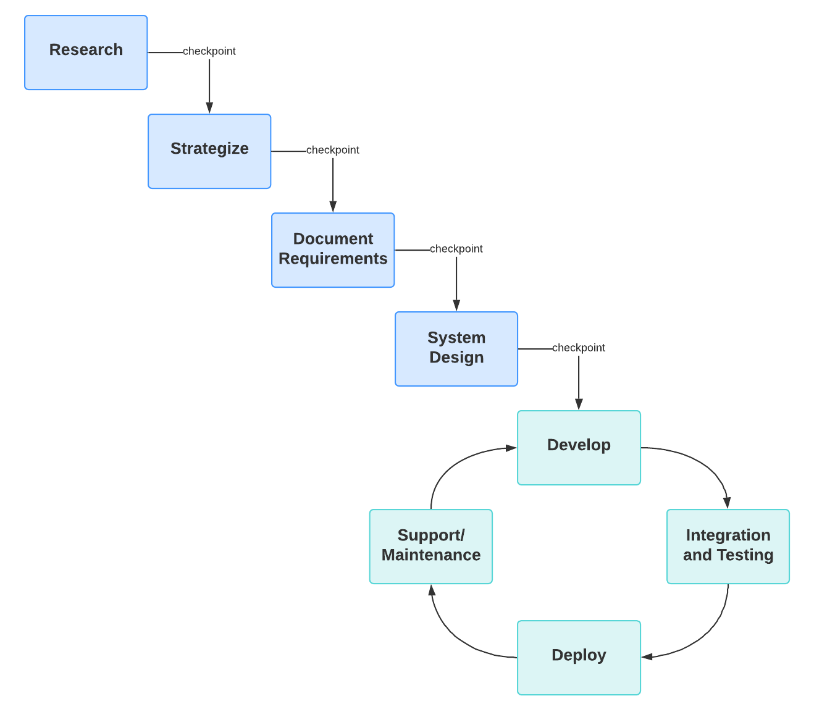

# Agile waterval projectmethodiek

Het project wordt voornamelijk door één software developer uitgevoerd. Daar waar gewenst zijn binnen Bluenotion collega's beschikbaar voor feedback en tips op het gebied van projectmanagement, UX, FE en het programmeren zelf maar deze collega's zijn in hun dagelijks werk aan het werk aan andere projecten.

Binnen Bluenotion wordt er een vereenvoudigde versie van SCRUM gehanteerd waar wel op een iteratieve wijze aan projecten wordt gewerkt maar een boel scrum rollen en ceremonies uit het [SCRUM manifesto](https://agilescrumgroup.nl/scrum-manifesto/) wegens tijdsbesparing en vermindering van complexiteit niet worden vervuld.

Voor het afstudeerproject dien ik in 18 weken voornamelijk in mijn eentje een softwareoplossing neer te zetten. Op het begin van het project staat de kern van wat er over 18 weken moet staan redelijk vast maar staan er een aantal technische vragen (onderzoek productive) open en zijn niet alle functionele eisen even compleet uitgelegd omdat er tijdens de toelichting over het project ook uitbreidingsplannen zijn besproken.

Om bij het afstudeerproject vroegtijdig project kritische aspecten te kunnen identificeren maar flexibiliteit te kunnen houden om onduidelijk beschreven (of nieuwe) functionaliteiten te kunnen implementeren is er gekozen voor een mix tussen agile en waterval, ook wel de [Hybride agile-watervalmethode](https://www.lucidchart.com/blog/nl/agile-waterval-hybride) genoemd.

Een hybride agile waterval methode kan op verschillende manieren ingezet worden. De manier waarop in dit project wordt gewerkt met de agile waterval is als volgt:

*Fig 2: agile waterval*
<!-- TODO: Bron agile waterval https://www.lucidchart.com/blog/nl/agile-waterval-hybride  -->

Zoals in de bovenstaande afbeelding aangegeven begint de methode met een kleine waterval waarin onderzoek wordt gedaan naar wat (en hoe) het systeem dient te functioneren. Tijdens deze waterval wordt voor de stakeholders een overkoepelend beeld geschetst van de functionele en niet functionele eisen aan het systeem maar worden vooral ook de risico's en onzekerheden binnen het project vastgelegd. Hiermee wordt op een vroeg stadium duidelijk wat potentiële limitaties zijn zodat dit niet in een latere sprint als "verrassing" terugkomt.

Fases binnen de ontwikkeling van dit project:

Waterval:

Deze fases worden één keer in serie doorlopen.

- Research

In deze fase worden de risico's en onzekerheden van het project geidentificeerd en worden hier oplossingen voor gezocht.

- Strategize

In deze fase worden keuzes gemaakt op basis van de onderzoeken gedaan in de research fase.

- Document requirements

In deze fase van het project worden de initiele functionele en nonfunctionele requirements verzameld en gedocumenteerd

- System design

In deze fase wordt het architectuur van het project opgezet, de technische uitdagingen die in de research en strategize fases dienen hier een antwoord te hebben.

Agile:

Deze fases worden herhaaldelijk elke sprint doorlopen.

- Develop

In deze fase wordt nieuwe functionaliteit ontwikkeld

- Integration and testing

In deze fase wordt de nieuwe functionaliteit getest en er voor gezorgd dat de nieuwe functionaliteit geen bestaande functionaliteiten sloopt.

- Deploy

In deze fase wordt de nieuwe functionaliteit afgerond.

- Support/maintenance

?

Nadat het initiële software ontwerp is gemaakt wordt er overgeschakeld naar een agile methode. In het geval van dit afstudeerproject wordt hier gebruik gemaakt van de vereenvoudigde versie van SCRUM die binnen Bluenotion gehanteerd wordt.

De reden dat er eerst gewerkt wordt met een korte waterval is om een globaal beeld te krijgen van de functionaliteiten die voor het portaal nu en potentieel in de toekomst gewenst zijn maar vooral ook zodat eerst een goed onderzoek gedaan kan worden naar de wijze waarop het portaal met de Productive API gaat communiceren. Met de [rate limits](https://developer.productive.io/#header-rate-limits) die op de Productive API gehanteerd worden zou het voor een applicatie met weinig gebruikers mogelijk zijn om hier direct mee te communiceren. Binnen de initiële waterval worden de functionaliteiten van het project verzameld waarmee een concreter beeld geschetst kan worden van de potentiële data flow tussen de twee applicaties. Hierna wordt aan de hand van een onderzoek en proof of concept een wijze van caching of database synchronisatie uit gepland en uitgewerkt tot een proof of concept module waar de rest van de applicatie op kan doorbouwen.

Nadat er een standaard wijze voor efficient data ontvangen en versturen van en naar Productive worden de rest van de functionaliteiten binnen de vereenvoudigde versie van SCRUM die grotendeels binnen Bluenotion gehanteerd wordt uitgewerkt.

De punten die overgenomen worden van SCRUM zijn:

Sprint retrospective:

Zolang er niet regelmatig binnen een team wordt gewerkt wordt ook de retrospective niet meegenomen als aparte ceremonie. Dit omdat er tijdens de retrospective wordt gereflecteerd op het handelen en samenwerken van het team. Om de waarde van de retrospective toch niet volledig te niet te doen krijgen de bedrijfsbegeleider en opdrachtgever (beiden stakeholders van het PMP) aan het eind van sprint review het verzoek het liefst aan de hand van de [zeester methode](https://insightful.be/ontdek-de-starfish-retrospective-methode/) feedback te geven op de kwaliteit van de doorlopen processen.

Sprint review:

De sprint review wordt grotendeels gehouden zoals beschreven in het [SCRUM manifesto](https://agilescrumgroup.nl/scrum-manifesto/). De in de afgelopen sprint gemaakte functionaliteit wordt aan de stakeholders voorgelegd met de vraag hier feedback op te geven. Hierna wordt samen met de stakeholders een planning opgezet voor de volgende sprint en de functionaliteiten die de stakeholders graag zouden willen zien in de volgende sprint. Door deze twee acties wordt er over de loop van het project oog gehouden op of het geleverde werk overeenkomt met de wensen van de opdrachtgever en de andere stakeholders.

backlog:

Binnen dit project wordt gebruik gemaakt van een project backlog en sprint backlog om in beeld te houden welke taken nog voor het project gedaan moeten worden en wat er op de planning staat voor de huidige sprint. De sprint backlog wordt in overleg met de opdrachtgever tijdens de sprint review besproken.

Definition of Ready (DoR) & Definition of Done (DoD):

De DoD en DoR bevatten definities voor wanneer er aan een taak of functionaliteit begonnen mag worden en wanneer deze klaar is. Omdat deze twee doelen los van elkaar staan kan het voor komen dat een taak in de ene sprint Ready dient te zijn maar pas de volgende sprint Done.

De DoR heeft voornamelijk betrekking op documentatie die gemaakt dient te worden om de functionaliteit naar de stakeholders te kunnen communiceren. Het doel hiervan is voordat er functionaliteit uitgewerkt wordt duidelijk met de stakeholders te kunnen communiceren over wat wanneer waarom gemaakt wordt.

De DoD bevat definities voor wanneer een functionaliteit klaar is. Hier wordt meer ingegaan op de code en technische documentatie dan in de DoR. Het doel van de DoR is het testen van de geleverde functionaliteit, onderhouden van de code kwaliteit en garanderen van de traceability tussen code en documentatie.

<!-- TODO: bron dod dor -->

<!-- https://www.lucidchart.com/blog/nl/agile-waterval-hybride -->
